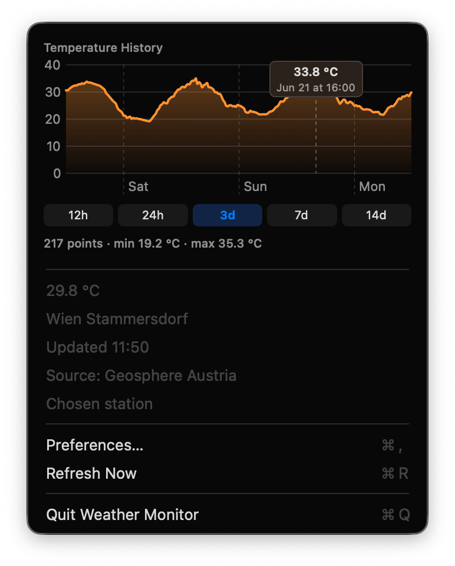

# Weather Monitor

A tiny macOS menu bar app that shows the current local outdoor temperature. It finds the weather station nearest to your location using the Geosphere Austria Data Hub and falls back to Open-Meteo when no Austrian station is close enough.



Disclaimer: Entirely written using Claude Opus 4.8.

## How it works

The app determines your location, then fetches the temperature in this order:

- Your position comes from CoreLocation. If you decline the permission prompt or location services are unavailable, it falls back to an approximate location derived from your public IP address.
- It downloads the Geosphere Austria station list (TAWES 10-minute network), picks the nearest active stations, and reads the current air temperature (`TL`) from the closest one that is reporting.
- If the nearest Austrian station is more than 150 km away (so you are probably outside Austria) or Geosphere is unreachable, it uses the free, key-less Open-Meteo API for the temperature at your coordinates.

The temperature appears in the menu bar. Click it to see the history chart, the station name and distance, when the reading was taken, the data source, and your location, and to open preferences or trigger a manual refresh.

## Preferences

Open Preferences from the menu bar to configure:

- Refresh frequency (5, 10, 15, 30, or 60 minutes).
- Location: either automatic (your location) or a specific weather station picked from a dropdown of all Geosphere stations. Choosing a station skips location detection and reads that station directly.

## History chart

The menu shows a temperature curve right at the top, drawn with Swift Charts. The data is pulled live from the same APIs rather than accumulated locally: for a Geosphere station it reads the 10-minute historical series (`station/historical/tawes-v1-10min`), and for an Open-Meteo location it reads the hourly series. Buttons below the chart switch the window between 12 hours, 24 hours, 3 days, 7 days, and 14 days, and hovering (or click-dragging) across the chart shows the temperature and time at that point.

Each lookup is cached in memory, so switching ranges — or returning to a station you have already viewed — is instant. Nothing is written to disk; the chart refetches a current window after each refresh.

## Requirements

- macOS 13 or later
- A Swift toolchain (Xcode or the Command Line Tools: `xcode-select --install`)

## Build and run

```sh
./build.sh run
```

This compiles the app, assembles `WeatherMonitor.app`, signs it ad-hoc, and launches it. To only build the bundle without launching, run `./build.sh`.

The first launch shows a system prompt asking to use your location. Allow it for the nearest-station feature; if you deny it, the app still works using the IP-based fallback.

## Run at login

To start the app automatically, move `WeatherMonitor.app` to `/Applications` and add it under System Settings → General → Login Items.

## Notes

- The app has no Dock icon or main window — it lives entirely in the menu bar (`LSUIElement`).
- No API keys are required. Both Geosphere Austria and Open-Meteo are open APIs.
- Geosphere API docs: https://dataset.api.hub.geosphere.at/v1/docs/

## License

Copyright (c) 2026, Werner Robitza.

Permission is hereby granted, free of charge, to any person obtaining a copy of this software and associated documentation files (the “Software”), to deal in the Software without restriction, including without limitation the rights to use, copy, modify, merge, publish, distribute, sublicense, and/or sell copies of the Software, and to permit persons to whom the Software is furnished to do so, subject to the following conditions:

The above copyright notice and this permission notice shall be included in all copies or substantial portions of the Software.

THE SOFTWARE IS PROVIDED “AS IS”, WITHOUT WARRANTY OF ANY KIND, EXPRESS OR IMPLIED, INCLUDING BUT NOT LIMITED TO THE WARRANTIES OF MERCHANTABILITY, FITNESS FOR A PARTICULAR PURPOSE AND NONINFRINGEMENT. IN NO EVENT SHALL THE AUTHORS OR COPYRIGHT HOLDERS BE LIABLE FOR ANY CLAIM, DAMAGES OR OTHER LIABILITY, WHETHER IN AN ACTION OF CONTRACT, TORT OR OTHERWISE, ARISING FROM, OUT OF OR IN CONNECTION WITH THE SOFTWARE OR THE USE OR OTHER DEALINGS IN THE SOFTWARE.
